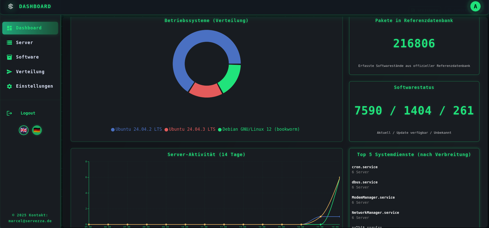

# Servezza – Admin & Operator Guide

**Date:** 2025-08-15  
**Version:** 1.0

---

## Introduction

**Servezza** is a lightweight, secure **server inventory** and **update management** platform for Linux fleets.

**Purpose:**  
- Centralize server inventory  
- Collect installed software lists  
- Compare against reference repositories  
- Evaluate update status  
- Safely run whitelisted jobs across servers  

**Main features:**  
- Server registry with one-line agent install  
- Automatic system and software inventory collection  
- Reference repository discovery & import (Debian/Ubuntu, Fedora/RHEL, openSUSE, Arch/Manjaro, CentOS, Alpine)  
- Update status evaluation (installed vs. reference versions)  
- Whitelist-governed job execution with templates and history  
- Server groups for bulk operations  
- Simple reachability (ping) checks  

**Target audience:** Sysadmins, SREs, and DevOps teams in SMBs and enterprises.  
**Deployment:** Runs entirely with the provided `docker-compose.yml`.  

---

## Images




## System requirements

### Deployment host
- Linux with Docker Engine + Compose v2
- Small setups: 2 vCPU / 2–4 GB RAM
- Storage: ~10–50 GB (depends on DB growth and imported references)
- Network: Ports 80 (HTTP redirect) and 443 (HTTPS) exposed

### Managed servers (agent)
- OS: Linux (systemd recommended)
- Tools: `python3`, `curl`, `dmidecode`, native package manager (`apt`, `dnf`, `yum`, `zypper`, `pacman`, `apk`), `sudo`

---

## Supported platforms

- **Agent targets:** Debian/Ubuntu, Fedora/RHEL (Alma, Rocky, CentOS Stream), openSUSE/SLES, Arch/Manjaro, Alpine Linux. Snap/Flatpak detection supported.  
- **Backend & Frontend:** Run inside Docker containers on any Linux host. Portainer support included.  

---

## Architecture

The stack consists of four services, provisioned by `docker-compose.yml`:

- **Backend** (`ghcr.io/servezza/servezza-backend:latest`)  
  - FastAPI application, listens on port 8000 inside container  
  - Provides REST API (`/api/...`) and JWT-based authentication  
  - Seeds admin account and default whitelist on first start  

- **Frontend** (`ghcr.io/servezza/servezza-frontend:latest`)  
  - React-based web UI served by Nginx on port 80 inside container  

- **Nginx** (`ghcr.io/servezza/servezza-nginx:latest`)  
  - Acts as reverse proxy, listens on host ports 80 (HTTP) and 443 (HTTPS)  
  - Terminates TLS, forwards API requests to backend and UI requests to frontend  

- **Database** (`postgres:16`)  
  - PostgreSQL with persistent volume for data storage  

**Networking:**  
- All containers run in a dedicated bridge network `servezza-net`  
- Only Nginx is exposed publicly  

---

## Installation & setup

### Step 1 – Prepare directories

```bash
mkdir -p servezza/nginx/certs
cd servezza
```

### Step 2 – Configure docker-compose.yml

Open `docker-compose.yml` and adjust the following placeholders:

| Variable           | Purpose                                                |
|--------------------|--------------------------------------------------------|
| `DATABASE_URL`     | DSN for PostgreSQL (`postgresql+psycopg2://user:pass@db:5432/servezza`) |
| `POSTGRES_USER`    | DB username                                            |
| `POSTGRES_PASSWORD`| DB password                                            |
| `POSTGRES_DB`      | DB name (default: `servezza`)                          |
| `BACKEND_PUBLIC_URL` | Public base URL of backend (must be HTTPS in production) |
| `ALLOWED_ORIGINS`  | Comma-separated list of allowed frontend origins       |
| `ADMIN_USER`       | Initial admin username                                |
| `ADMIN_PASS`       | Initial admin password                                |
| `JWT_SECRET`       | Long random hex string (`openssl rand -hex 32`)        |

Optional backend tuning variables (set inside backend service):  
- `DB_POOL_SIZE`, `DB_MAX_OVERFLOW`, `DB_POOL_TIMEOUT`, `DB_POOL_RECYCLE`  
- `FAST_REFERENCE_LEARNING`, `FAST_REFERENCE_LEARNING_LOG`, `DISABLE_LEARN_PRERELEASE`, `CLASSIFICATION_DEBUG`, `REFCACHE_INVALIDATE_FILE`  

### Step 3 – TLS Certificates

Mount your certificates into `nginx/certs` as `fullchain.pem` and `privkey.pem`.  
For local tests you can use self-signed certs or run behind another reverse proxy (e.g., Zoraxy, Traefik, Caddy).

### Step 4 – Start the stack

```bash
docker compose up -d
docker compose ps
```

---

## Access

- **UI:** `https://<your-domain>/`  
- **API health:** `https://<your-domain>/api/health`  

Login with `ADMIN_USER` / `ADMIN_PASS` (from compose). Immediately change the password in the UI.

---

## Agent installation

1. In the UI, create a new server entry.  
2. Copy the generated one-line installer.  
3. Run it with `sudo` on the target machine.  

The installer will:  
- Create user/group `servezza`  
- Install `dmidecode`  
- Download `/static/client.py` and `/static/servezza-wrapper.py` to `/usr/local/bin`  
- Write `/etc/servezza-client.conf` with server URL, token, and ID  
- Install and start the systemd service `servezza-client.service`  

---

## Using Servezza

### Web UI

- **Dashboard:** Fleet stats, top updates, widgets  
- **Servers:** List servers, details, last check-in, client version  
- **Software:** Per-server package view with update status  
- **Jobs:** Create templates, dispatch jobs, track history/results  
- **Discovery/Import:** Manage sources, selections, imports  
- **Settings:** Manage whitelist entries and server groups  

### Typical workflows

- **Inventory & updates:** Add servers → import reference repos → check software overview  
- **Safe updates via jobs:** Review whitelist → create job template → dispatch → track in history  
- **Organize servers:** Use groups for bulk operations  
- **Reachability:** Ping checks to validate connectivity  

### API (selected)

- Auth: `POST /api/auth/login`, `GET /api/auth/me`, `POST /api/auth/logout`  
- Servers: `GET/POST /api/servers`, `POST /api/servers/{id}/checkin`, `POST /api/servers/{id}/inventory`  
- Jobs: `POST /api/jobs`, `GET /api/jobs/history`, `POST /api/jobs/{job_target_id}/result`  
- Whitelist: `GET/POST/PUT/DELETE /api/whitelist`  
- Groups: `GET/POST/PUT/DELETE /api/server_groups`  
- Discovery/Imports: `POST /api/discovery/run`, `POST /api/import/run`  

---

## Client usage

The client (`/usr/local/bin/servezza-client.py`) runs as a systemd service `servezza-client.service`.  
Wrapper enforces whitelist restrictions for privileged commands.

### Flags

- `--token`: Assigned token for this server  
- `--server`: API base URL  
- `--id`: Server ID  
- `--interval`: Check-in interval (default 180s)  
- `--inventory-interval`: Inventory interval (default 8h)  
- `--job-poll-interval`: Job polling interval (default 60s)  
- `--send-inventory-once`: Send inventory once and exit  
- `--install-service`: Install & enable systemd service  
- `--uninstall`: Remove client completely  
- `--version`: Print client version and exit  

### Commands

```bash
# One-time inventory
sudo servezza-client.py --send-inventory-once

# Install service
sudo servezza-client.py --install-service
sudo systemctl enable --now servezza-client.service

# Uninstall
sudo servezza-client.py --uninstall
```

---

## Administration & maintenance

### Users & permissions

- Current: single seeded admin account  
- Planned: RBAC / OIDC support  

### Backup & restore

```bash
# Backup
docker compose exec -T db pg_dump -U "$POSTGRES_USER" "$POSTGRES_DB" > servezza_backup.sql

# Restore
docker compose exec -T db psql -U "$POSTGRES_USER" "$POSTGRES_DB" < servezza_backup.sql
```

Also back up:  
- `nginx/certs`  
- any custom log/config files (e.g. FAST_REFERENCE_LEARNING_LOG)  

### Logging & monitoring

- Logs: `docker compose logs -f <service>`  
- Health: `GET /api/health`  
- Scheduler: background refresh every 6h  

### Updates

- Application: `docker compose pull && docker compose up -d`  
- Agents: `POST /api/servers/update_all_agents`  

---

## Troubleshooting

- **Login issues:** Always use HTTPS; `BACKEND_PUBLIC_URL` must be HTTPS.  
- **DB connection errors:** Verify `DATABASE_URL` and db credentials.  
- **Agent no data:** Check `systemctl status servezza-client.service` and config in `/etc/servezza-client.conf`.  
- **Jobs rejected:** Validator or whitelist denied command. Adjust patterns/templates.  
- **References unknown:** Ensure repos imported successfully.  
- **Ping unreachable:** Verify target IP/hostname and backend host connectivity.  

---

## Security recommendations

- Always deploy with HTTPS and strong `JWT_SECRET`  
- Restrict `ALLOWED_ORIGINS` to trusted domains  
- Rotate TLS certificates regularly  
- Backup DB and certs frequently  
- Keep whitelist restrictive and job templates minimal  

---

## License

MIT License  

Copyright (c) 2025 Marcel Graewer

Permission is hereby granted, free of charge, to any person obtaining a copy
of this software and associated documentation files (the "Software"), to deal
in the Software without restriction, including without limitation the rights
to use, copy, modify, merge, publish, distribute, sublicense, and/or sell
copies of the Software, and to permit persons to whom the Software is
furnished to do so, subject to the following conditions:

The above copyright notice and this permission notice shall be included in all
copies or substantial portions of the Software.

THE SOFTWARE IS PROVIDED "AS IS", WITHOUT WARRANTY OF ANY KIND, EXPRESS OR
IMPLIED, INCLUDING BUT NOT LIMITED TO THE WARRANTIES OF MERCHANTABILITY,
FITNESS FOR A PARTICULAR PURPOSE AND NONINFRINGEMENT. IN NO EVENT SHALL THE
AUTHORS OR COPYRIGHT HOLDERS BE LIABLE FOR ANY CLAIM, DAMAGES, OR OTHER
LIABILITY, WHETHER IN AN ACTION OF CONTRACT, TORT OR OTHERWISE, ARISING FROM,
OUT OF, OR IN CONNECTION WITH THE SOFTWARE OR THE USE OR OTHER DEALINGS IN THE
SOFTWARE.
